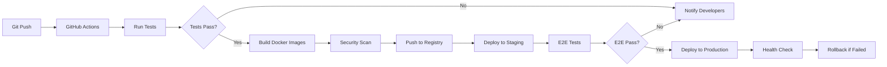

# ResearchHive: Technical Architecture

## 🏗️ System Architecture Overview

ResearchHive follows a modern microservices architecture with event-driven communication, leveraging open-source platforms extended with AI capabilities.

### High-Level Architecture Diagram

```
┌─────────────────────────────────────────────────────────────────┐
│                         CLIENT LAYER                             │
├─────────────────────────────────────────────────────────────────┤
│  Next.js 14 App    │  Mobile PWA    │  VS Code Extension        │
│  (React + tRPC)    │  (Capacitor)   │  (MCP Client)             │
└─────────────┬───────────────────────────────────────────────────┘
              │
┌─────────────▼───────────────────────────────────────────────────┐
│                      API GATEWAY LAYER                           │
├─────────────────────────────────────────────────────────────────┤
│  Kong API Gateway                                                │
│  ├── Rate Limiting (Redis)                                       │
│  ├── Authentication (JWT + OAuth2)                               │
│  ├── Load Balancing (Round Robin + Least Conn)                   │
│  └── API Analytics (Prometheus)                                  │
└─────────────┬───────────────────────────────────────────────────┘
              │
┌─────────────▼───────────────────────────────────────────────────┐
│                    APPLICATION SERVICES                          │
├──────────────────┬──────────────────┬───────────────────────────┤
│                  │                  │                           │
│  Research API    │  Content CMS     │  Workflow Engine          │
│  (Node.js +      │  (Strapi v4)     │  (n8n)                    │
│   TypeScript)    │  Extended with:  │  Custom Nodes:            │
│                  │  - AI plugins    │  - Agent orchestration    │
│  Features:       │  - Vector search │  - Research automation    │
│  - tRPC routes   │  - Team collab   │  - Data pipelines         │
│  - MCP server    │  - SSE streaming │  - Webhook handlers       │
│  - Agent mgmt    │                  │                           │
│                  │                  │                           │
└────────┬─────────┴────────┬─────────┴─────────┬─────────────────┘
         │                  │                   │
┌────────▼──────────────────▼───────────────────▼─────────────────┐
│                      AI AGENT LAYER                              │
├─────────────────────────────────────────────────────────────────┤
│  Claude-Flow Swarm Orchestrator (v3.x alpha)                    │
│  ├── Queen Agent (Coordinator)                                   │
│  ├── Research Agents (8x parallel)                               │
│  │   ├── Web Scraper Agent (Puppeteer + Playwright)             │
│  │   ├── Academic Search Agent (arXiv, PubMed, Semantic Scholar)│
│  │   ├── News Aggregator Agent (NewsAPI, RSS feeds)             │
│  │   └── Social Media Agent (Twitter, Reddit, HN APIs)          │
│  ├── Analysis Agents (4x parallel)                               │
│  │   ├── Summarizer Agent (HuggingFace: BART, T5)               │
│  │   ├── Fact Checker Agent (Cross-reference + credibility)     │
│  │   ├── Sentiment Analyzer (HuggingFace: DistilBERT)           │
│  │   └── Entity Extractor Agent (HuggingFace: NER models)       │
│  ├── Synthesis Agents (2x)                                       │
│  │   ├── Knowledge Graph Builder (Neo4j integration)            │
│  │   └── Report Generator (LangChain + Templates)               │
│  └── Memory Manager (AgentDB integration)                        │
│                                                                   │
│  Topology: Mesh network with QUIC protocol                       │
│  MCP Communication: SSE for streaming, stdio for local           │
└─────────────┬───────────────────────────────────────────────────┘
              │
┌─────────────▼───────────────────────────────────────────────────┐
│                      DATA LAYER                                  │
├──────────────────┬──────────────────┬───────────────────────────┤
│                  │                  │                           │
│  Primary DB      │  Vector Store    │  Cache Layer              │
│  PostgreSQL 16   │  AgentDB +       │  Redis 7.x                │
│                  │  Qdrant          │                           │
│  Schemas:        │                  │  Cached:                  │
│  - Users/Teams   │  Collections:    │  - Session data           │
│  - Projects      │  - Documents     │  - API responses          │
│  - Research      │  - Embeddings    │  - Agent states           │
│  - Citations     │  - Memories      │  - Rate limits            │
│  - Audit logs    │  - Knowledge     │                           │
│                  │                  │                           │
│  Extensions:     │  Features:       │  Patterns:                │
│  - pgvector      │  - HNSW index    │  - Cache-aside            │
│  - TimescaleDB   │  - Reflexion     │  - Write-through          │
│  - PostGIS       │  - Causal graph  │  - TTL policies           │
│                  │                  │                           │
└────────┬─────────┴────────┬─────────┴─────────┬─────────────────┘
         │                  │                   │
┌────────▼──────────────────▼───────────────────▼─────────────────┐
│                   SEARCH & ANALYTICS                             │
├─────────────────────────────────────────────────────────────────┤
│  Meilisearch (Primary Search)      │  Analytics Stack           │
│  - Full-text search                 │  - Prometheus (metrics)    │
│  - Typo tolerance                   │  - Grafana (dashboards)    │
│  - Faceted search                   │  - Loki (logs)             │
│  - Custom ranking rules             │  - Jaeger (tracing)        │
│                                     │  - Plausible (web analytics)│
└─────────────────────────────────────────────────────────────────┘
         │
┌────────▼─────────────────────────────────────────────────────────┐
│                   MESSAGE QUEUE & EVENTS                          │
├──────────────────────────────────────────────────────────────────┤
│  RabbitMQ with MQTT + AMQP                                       │
│  Exchanges:                                                       │
│  ├── research.events (fanout) - Broadcast research updates       │
│  ├── agent.tasks (topic) - Route tasks to specific agents        │
│  ├── system.commands (direct) - System control messages          │
│  └── analytics.logs (headers) - Structured event logging         │
│                                                                   │
│  Queues:                                                          │
│  ├── high-priority (SLA: <100ms)                                 │
│  ├── standard (SLA: <1s)                                          │
│  └── batch (SLA: <1m)                                             │
└──────────────────────────────────────────────────────────────────┘
         │
┌────────▼─────────────────────────────────────────────────────────┐
│                   EXTERNAL INTEGRATIONS                           │
├──────────────────────────────────────────────────────────────────┤
│  HuggingFace Inference API  │  OpenRouter (Multi-LLM)            │
│  - Text generation          │  - Claude 3.5 Sonnet (reasoning)   │
│  - Summarization (BART)     │  - DeepSeek (cost-optimized)       │
│  - NER (BERT variants)      │  - Gemini Flash (speed)            │
│  - Sentiment (DistilBERT)   │  - Llama 3.1 (local fallback)      │
│  - Embeddings (all-MiniLM)  │                                    │
│                             │                                     │
│  Data Sources:              │  Observability:                     │
│  - NewsAPI                  │  - Sentry (error tracking)          │
│  - arXiv API                │  - Better Stack (uptime)            │
│  - Semantic Scholar         │  - PostHog (product analytics)      │
│  - Twitter API v2           │                                     │
│  - Reddit API               │                                     │
│  - RSS aggregators          │                                     │
└──────────────────────────────────────────────────────────────────┘
```

## 🔧 Technology Stack

### Frontend Stack

**Core Framework:**
- **Next.js 14** (App Router) - Server components + client components
- **React 18** - Concurrent rendering, Suspense
- **TypeScript 5.3** - Strict mode enabled
- **tRPC 10** - End-to-end type safety

**UI/UX:**
- **Tailwind CSS 3.4** - Utility-first styling
- **Shadcn/ui** - Accessible component library
- **Radix UI** - Unstyled primitives
- **Framer Motion** - Animations
- **React Flow** - Knowledge graph visualization

**State Management:**
- **Zustand** - Global state
- **TanStack Query (React Query)** - Server state
- **Jotai** - Atomic state (lightweight)

**Real-Time:**
- **Socket.io Client** - WebSocket connections
- **EventSource API** - Server-Sent Events (MCP)
- **SWR** - Real-time data fetching

**Testing:**
- **Vitest** - Unit tests
- **Playwright** - E2E tests
- **Testing Library** - Component tests
- **MSW** - API mocking

**Build Tools:**
- **Turborepo** - Monorepo orchestration
- **tsup** - TypeScript bundler
- **Prettier + ESLint** - Code formatting

### Backend Stack

**Core Framework:**
- **Node.js 20 LTS** (with ESM modules)
- **TypeScript 5.3**
- **tRPC 10** - API layer
- **Fastify** - HTTP server (faster than Express)

**Extended Open-Source Platforms:**

**1. Strapi v4 (Headless CMS)**
```typescript
// Custom plugins
├── strapi-plugin-vector-search
│   └── Integrates AgentDB for semantic search
├── strapi-plugin-ai-content
│   └── AI-powered content suggestions
├── strapi-plugin-research
│   └── Research project management
└── strapi-plugin-citations
    └── Automatic citation management
```

**2. n8n (Workflow Automation)**
```typescript
// Custom nodes
├── @researchhive/n8n-nodes-claude-flow
│   └── Agent orchestration workflows
├── @researchhive/n8n-nodes-research
│   └── Multi-source research automation
├── @researchhive/n8n-nodes-agentdb
│   └── Vector database operations
└── @researchhive/n8n-nodes-synthesis
    └── Knowledge synthesis pipelines
```

**Authentication & Authorization:**
- **Logto** (Open-source Auth0 alternative)
  - OAuth 2.0 / OIDC provider
  - Social logins (Google, GitHub, Twitter)
  - MFA support
  - Custom claims for RBAC

**AI/ML Integration:**
- **claude-flow** (v3.x alpha) - Agent orchestration
- **agentdb** (v1.6.1) - Vector database
- **research-swarm** (v1.2.2) - Multi-agent research
- **LangChain.js** - LLM chains and tools
- **HuggingFace Transformers.js** - Browser-based inference
- **OpenRouter SDK** - Multi-model routing

**Database:**
- **PostgreSQL 16** (Primary database)
  - Extensions: pgvector, TimescaleDB, PostGIS
  - Connection pooling: PgBouncer
- **Qdrant** (Vector database for embeddings)
- **Redis 7** (Cache + session store)
- **AgentDB** (Reflexive memory + causal graphs)

**Search:**
- **Meilisearch** (Primary search engine)
  - Custom ranking rules
  - Typo tolerance
  - Faceted search
  - Geo-search support

**Message Queue:**
- **RabbitMQ** (AMQP + MQTT protocols)
  - Durable queues
  - Dead letter exchanges
  - Priority queues
  - Message TTL

**API Gateway:**
- **Kong Gateway** (Open-source)
  - Rate limiting plugin
  - JWT authentication
  - CORS handling
  - Request/response transformation
  - API analytics

**Monitoring & Observability:**
- **Prometheus** - Metrics collection
- **Grafana** - Visualization dashboards
- **Loki** - Log aggregation
- **Jaeger** - Distributed tracing
- **Sentry** - Error tracking
- **Plausible** - Privacy-friendly web analytics

### DevOps & Infrastructure

**Containerization:**
- **Docker 24+** - All services containerized
- **Docker Compose** - Local development
- **Dockerfile best practices** - Multi-stage builds, layer caching

**Orchestration:**
- **Kubernetes 1.28+** - Production orchestration
- **Helm 3** - Package management
- **Kustomize** - Environment-specific configs

**CI/CD:**
- **GitHub Actions** - CI/CD pipelines
  - Automated testing (unit, integration, E2E)
  - Docker image building
  - Semantic versioning
  - Automated deployments
  - Security scanning (Snyk, Trivy)

**Infrastructure as Code:**
- **Terraform** - Cloud resources
- **Pulumi** (TypeScript) - Alternative IaC
- **Ansible** - Configuration management

**Cloud Providers (Multi-cloud):**
- **Primary: DigitalOcean Kubernetes (DOKS)**
  - Cost-effective for startups
  - Simple pricing model
  - Managed Kubernetes

- **Alternative: AWS**
  - EKS (Kubernetes)
  - RDS (PostgreSQL)
  - ElastiCache (Redis)
  - S3 (file storage)

- **CDN: Cloudflare**
  - Global edge network
  - DDoS protection
  - Image optimization

## 🤖 AI Agent Architecture

### Claude-Flow Swarm Configuration

**Swarm Topology: Mesh Network**
```javascript
// config/swarm.config.js
export default {
  topology: 'mesh',
  protocol: 'quic', // 50-70% faster than TCP
  agents: [
    // Coordinator
    { type: 'queen', count: 1, role: 'coordinator' },

    // Research tier
    { type: 'researcher', count: 8, role: 'data_gathering', parallel: true },

    // Analysis tier
    { type: 'analyzer', count: 4, role: 'data_processing', parallel: true },

    // Synthesis tier
    { type: 'synthesizer', count: 2, role: 'knowledge_creation' },
  ],
  memory: {
    backend: 'agentdb',
    reflexion: true,
    causal: true,
    episodic: true,
  },
  optimization: {
    modelRouter: {
      complex: 'claude-3.5-sonnet', // Deep reasoning
      standard: 'deepseek/deepseek-chat', // Cost-optimized
      fast: 'google/gemini-flash-1.5', // Quick responses
      local: 'onnx', // Free inference
    },
  },
};
```

### Agent Specializations

**1. Research Agents (8 parallel instances)**
- **Web Scraper Agent:** Puppeteer + Playwright for dynamic content
- **Academic Search Agent:** arXiv, PubMed, Semantic Scholar APIs
- **News Aggregator Agent:** NewsAPI, RSS feeds, web scraping
- **Social Media Agent:** Twitter API v2, Reddit API, Hacker News
- **Government Data Agent:** Data.gov, World Bank, WHO APIs
- **Patent Search Agent:** USPTO, EPO, WIPO databases
- **Code Search Agent:** GitHub search API, GitLab, Sourcegraph
- **Market Data Agent:** Financial APIs (Alpha Vantage, Yahoo Finance)

**2. Analysis Agents (4 parallel instances)**
- **Summarizer Agent:**
  - HuggingFace models: facebook/bart-large-cnn, google/pegasus-xsum
  - Extractive + abstractive summarization
  - Multi-document synthesis

- **Fact Checker Agent:**
  - Cross-reference verification
  - Source credibility scoring
  - Claim extraction and validation

- **Sentiment Analyzer Agent:**
  - HuggingFace: distilbert-base-uncased-finetuned-sst-2-english
  - Aspect-based sentiment
  - Emotion detection (joy, anger, fear, etc.)

- **Entity Extractor Agent:**
  - HuggingFace NER: dslim/bert-base-NER
  - Custom entity types (companies, technologies, metrics)
  - Relationship extraction

**3. Synthesis Agents (2 instances)**
- **Knowledge Graph Builder:**
  - Neo4j graph database
  - Automatic relationship discovery
  - Causal inference

- **Report Generator:**
  - Template-based generation
  - Citation formatting (APA, MLA, Chicago)
  - Multi-format export (Markdown, PDF, DOCX)

**4. Memory Manager (1 instance)**
- AgentDB integration for reflexive learning
- Episode storage and retrieval
- Pattern recognition
- Skill library management

### MCP (Model Context Protocol) Implementation

**Server Configuration:**
```typescript
// src/mcp/server.ts
import { Server } from '@modelcontextprotocol/sdk/server/index.js';
import { SSEServerTransport } from '@modelcontextprotocol/sdk/server/sse.js';
import { StdioServerTransport } from '@modelcontextprotocol/sdk/server/stdio.js';

const server = new Server({
  name: 'researchhive-mcp',
  version: '1.0.0',
});

// Tools exposed via MCP
server.setRequestHandler('tools/list', async () => ({
  tools: [
    {
      name: 'research_topic',
      description: 'Research a topic using multi-agent swarm',
      inputSchema: {
        type: 'object',
        properties: {
          topic: { type: 'string' },
          depth: { type: 'string', enum: ['quick', 'standard', 'deep'] },
          sources: { type: 'array', items: { type: 'string' } },
        },
        required: ['topic'],
      },
    },
    {
      name: 'synthesize_findings',
      description: 'Synthesize research into structured report',
      inputSchema: {
        type: 'object',
        properties: {
          research_id: { type: 'string' },
          format: { type: 'string', enum: ['markdown', 'pdf', 'json'] },
          style: { type: 'string', enum: ['academic', 'business', 'casual'] },
        },
        required: ['research_id'],
      },
    },
    {
      name: 'query_knowledge_graph',
      description: 'Query the knowledge graph for insights',
      inputSchema: {
        type: 'object',
        properties: {
          query: { type: 'string' },
          max_depth: { type: 'number' },
        },
        required: ['query'],
      },
    },
  ],
}));

// SSE transport for web clients
export const sseTransport = new SSEServerTransport('/mcp/sse', server);

// Stdio transport for CLI/desktop apps
export const stdioTransport = new StdioServerTransport();
```

**Client Integration (Frontend):**
```typescript
// src/lib/mcp-client.ts
import { Client } from '@modelcontextprotocol/sdk/client/index.js';
import { SSEClientTransport } from '@modelcontextprotocol/sdk/client/sse.js';

export async function createMCPClient() {
  const client = new Client({
    name: 'researchhive-web',
    version: '1.0.0',
  });

  const transport = new SSEClientTransport(
    new URL('http://localhost:3000/api/mcp/sse')
  );

  await client.connect(transport);
  return client;
}

// Usage in React component
const researchTopic = async (topic: string) => {
  const client = await createMCPClient();

  const result = await client.request({
    method: 'tools/call',
    params: {
      name: 'research_topic',
      arguments: {
        topic,
        depth: 'standard',
        sources: ['web', 'academic', 'news'],
      },
    },
  });

  return result;
};
```

## 🔌 HuggingFace Integration

### Models Used

**1. Text Summarization**
- **Model:** `facebook/bart-large-cnn`
- **Use Case:** Multi-document summarization
- **API:** HuggingFace Inference API
```typescript
const summarize = async (text: string) => {
  const response = await fetch(
    'https://api-inference.huggingface.co/models/facebook/bart-large-cnn',
    {
      headers: { Authorization: `Bearer ${HF_API_KEY}` },
      method: 'POST',
      body: JSON.stringify({ inputs: text, parameters: { max_length: 150 } }),
    }
  );
  return await response.json();
};
```

**2. Named Entity Recognition (NER)**
- **Model:** `dslim/bert-base-NER`
- **Use Case:** Extract entities from research content
```typescript
const extractEntities = async (text: string) => {
  const response = await hfInference.tokenClassification({
    model: 'dslim/bert-base-NER',
    inputs: text,
  });
  return response;
};
```

**3. Sentiment Analysis**
- **Model:** `distilbert-base-uncased-finetuned-sst-2-english`
- **Use Case:** Analyze sentiment of news/social content
```typescript
const analyzeSentiment = async (text: string) => {
  const response = await hfInference.textClassification({
    model: 'distilbert-base-uncased-finetuned-sst-2-english',
    inputs: text,
  });
  return response;
};
```

**4. Text Embeddings**
- **Model:** `sentence-transformers/all-MiniLM-L6-v2`
- **Use Case:** Semantic search, similarity matching
```typescript
const generateEmbedding = async (text: string) => {
  const response = await hfInference.featureExtraction({
    model: 'sentence-transformers/all-MiniLM-L6-v2',
    inputs: text,
  });
  return response;
};
```

**5. Question Answering**
- **Model:** `deepset/roberta-base-squad2`
- **Use Case:** Extract answers from research documents
```typescript
const answerQuestion = async (question: string, context: string) => {
  const response = await hfInference.questionAnswering({
    model: 'deepset/roberta-base-squad2',
    inputs: { question, context },
  });
  return response;
};
```

**6. Zero-Shot Classification**
- **Model:** `facebook/bart-large-mnli`
- **Use Case:** Categorize content without training
```typescript
const classifyContent = async (text: string, labels: string[]) => {
  const response = await hfInference.zeroShotClassification({
    model: 'facebook/bart-large-mnli',
    inputs: text,
    parameters: { candidate_labels: labels },
  });
  return response;
};
```

### Cost Optimization Strategy

**Hybrid Inference Approach:**
1. **HuggingFace Inference API** - Pay-per-use for production
2. **Transformers.js** - Browser-based inference for simple tasks
3. **Local ONNX Runtime** - Self-hosted for high-volume tasks
4. **Caching Layer** - Redis cache for repeated queries

```typescript
// Smart routing based on complexity
const intelligentInference = async (task: Task) => {
  if (task.complexity === 'simple' && task.priority === 'low') {
    return await localONNXInference(task);
  } else if (task.canRunInBrowser) {
    return await transformersJSInference(task);
  } else {
    return await huggingFaceAPIInference(task);
  }
};
```

## 📊 Data Flow Architecture

### Research Workflow

```
User Input (Topic)
    │
    ▼
┌─────────────────────┐
│ Research API        │
│ (tRPC endpoint)     │
└──────────┬──────────┘
           │
           ▼
┌─────────────────────┐
│ RabbitMQ Queue      │
│ (agent.tasks)       │
└──────────┬──────────┘
           │
           ▼
┌─────────────────────────────────────────┐
│ Claude-Flow Queen Agent (Coordinator)   │
│ - Parse research request                │
│ - Create execution plan                 │
│ - Spawn specialized agents              │
└──────────┬──────────────────────────────┘
           │
           ▼
    ┌──────┴──────┐
    │             │
    ▼             ▼
┌─────────┐   ┌─────────┐
│Research │   │Analysis │
│Agents   │──▶│Agents   │
│(8x)     │   │(4x)     │
└────┬────┘   └────┬────┘
     │             │
     │ Emit events │
     │             │
     ▼             ▼
┌──────────────────────────┐
│ AgentDB (Memory Store)   │
│ - Store episodes         │
│ - Reflexive learning     │
│ - Causal relationships   │
└──────────┬───────────────┘
           │
           ▼
┌──────────────────────────┐
│ Synthesis Agents (2x)    │
│ - Knowledge graph        │
│ - Report generation      │
└──────────┬───────────────┘
           │
           ▼
┌──────────────────────────┐
│ PostgreSQL + Qdrant      │
│ - Store final research   │
│ - Index embeddings       │
└──────────┬───────────────┘
           │
           ▼
┌──────────────────────────┐
│ WebSocket Event          │
│ (Real-time update)       │
└──────────┬───────────────┘
           │
           ▼
    Frontend Updates
```

### Real-Time Collaboration Flow

```
User A Edits Research
    │
    ▼
┌─────────────────────────┐
│ Optimistic UI Update    │
│ (Immediate feedback)    │
└──────────┬──────────────┘
           │
           ▼
┌─────────────────────────┐
│ WebSocket Emit          │
│ (research.update event) │
└──────────┬──────────────┘
           │
           ▼
┌─────────────────────────┐
│ Redis Pub/Sub           │
│ (Broadcast to all)      │
└──────────┬──────────────┘
           │
           ▼
    ┌──────┴──────┐
    │             │
    ▼             ▼
User B        User C
(Update)      (Update)
```

## 🔐 Security Architecture

### Authentication Flow (Logto)

```
┌──────────┐         ┌──────────┐         ┌──────────┐
│  Client  │────────▶│  Logto   │────────▶│  OAuth   │
│          │  Auth   │  Server  │  Verify │ Provider │
│          │◀────────│          │◀────────│ (Google) │
└──────────┘  Token  └──────────┘  User   └──────────┘
     │                                Info
     │
     ▼
┌──────────────────────────┐
│ Kong API Gateway         │
│ - Validate JWT           │
│ - Check RBAC permissions │
│ - Rate limiting          │
└──────────┬───────────────┘
           │
           ▼
    Application Services
```

### RBAC Permissions Model

```yaml
roles:
  admin:
    permissions:
      - research:*
      - team:*
      - billing:*

  team_lead:
    permissions:
      - research:create
      - research:update:own
      - research:delete:own
      - team:invite
      - team:view

  member:
    permissions:
      - research:create
      - research:view:own
      - research:update:own

  viewer:
    permissions:
      - research:view:shared
```

### Data Encryption

- **At Rest:** AES-256 encryption (PostgreSQL transparent encryption)
- **In Transit:** TLS 1.3 for all connections
- **Secrets Management:** HashiCorp Vault / AWS Secrets Manager
- **API Keys:** Hashed with bcrypt, never stored in plaintext

## ⚡ Performance Optimization

### Caching Strategy

**Multi-Layer Cache:**
1. **Browser Cache** - Static assets (1 year TTL)
2. **CDN Cache** (Cloudflare) - Global edge caching
3. **Redis Cache** - API responses (5-60 min TTL)
4. **PostgreSQL Cache** - Query results (built-in)
5. **AgentDB Cache** - Vector search results (adaptive TTL)

**Cache Invalidation:**
- Event-driven invalidation on data updates
- Stale-while-revalidate pattern for non-critical data

### Database Optimization

**PostgreSQL:**
- Connection pooling (PgBouncer: 100 connections)
- Read replicas for analytics queries
- Partitioning for time-series data (research logs)
- Materialized views for dashboard queries

**Qdrant Vector DB:**
- HNSW indexing for O(log n) search
- Quantization for reduced memory footprint
- Sharding for horizontal scaling

**AgentDB:**
- SQLite backend for single-node (96x-164x faster)
- WASM for browser-based memory (no server needed)

### API Optimization

- **GraphQL/tRPC** - Request only needed fields
- **Pagination** - Cursor-based (stable, efficient)
- **Lazy Loading** - Load data on-demand
- **Compression** - gzip/brotli for responses
- **HTTP/2** - Multiplexing, server push

## 🚀 Scalability Architecture

### Horizontal Scaling

**Stateless Services:**
- Research API: Scale to 20+ pods (Kubernetes HPA)
- Agent orchestrator: Auto-scale based on queue depth
- Strapi CMS: Run 5+ replicas behind load balancer

**Stateful Services:**
- PostgreSQL: Primary + 2 read replicas
- Redis: Cluster mode (6 nodes, 3 shards)
- RabbitMQ: Clustered (3 nodes for HA)

### Load Balancing

**Kong Gateway:**
- Round-robin for general traffic
- Least connections for long-running requests
- Sticky sessions for WebSocket connections

**Database Load Balancing:**
- Write to primary
- Reads to replicas (random selection)
- Connection pooling with PgBouncer

### Auto-Scaling Policies

```yaml
# Kubernetes HPA
apiVersion: autoscaling/v2
kind: HorizontalPodAutoscaler
metadata:
  name: research-api-hpa
spec:
  scaleTargetRef:
    apiVersion: apps/v1
    kind: Deployment
    name: research-api
  minReplicas: 3
  maxReplicas: 20
  metrics:
  - type: Resource
    resource:
      name: cpu
      target:
        type: Utilization
        averageUtilization: 70
  - type: Resource
    resource:
      name: memory
      target:
        type: Utilization
        averageUtilization: 80
  - type: Pods
    pods:
      metric:
        name: http_requests_per_second
      target:
        type: AverageValue
        averageValue: "1000"
```

## 📦 Deployment Architecture

### Docker Compose (Local Development)

```yaml
version: '3.9'

services:
  # Frontend
  web:
    build: ./apps/web
    ports: ['3000:3000']
    environment:
      - NEXT_PUBLIC_API_URL=http://localhost:4000

  # Backend API
  api:
    build: ./apps/api
    ports: ['4000:4000']
    depends_on: [postgres, redis, rabbitmq]

  # Strapi CMS
  strapi:
    image: strapi/strapi:4.15
    ports: ['1337:1337']
    volumes: ['./apps/strapi:/srv/app']

  # n8n Workflows
  n8n:
    image: n8nio/n8n:latest
    ports: ['5678:5678']

  # Databases
  postgres:
    image: pgvector/pgvector:pg16
    ports: ['5432:5432']
    volumes: ['postgres_data:/var/lib/postgresql/data']

  redis:
    image: redis:7-alpine
    ports: ['6379:6379']

  qdrant:
    image: qdrant/qdrant:latest
    ports: ['6333:6333']

  # Message Queue
  rabbitmq:
    image: rabbitmq:3-management
    ports: ['5672:5672', '15672:15672']

  # Search
  meilisearch:
    image: getmeili/meilisearch:v1.5
    ports: ['7700:7700']

  # API Gateway
  kong:
    image: kong:latest
    ports: ['8000:8000', '8001:8001']

  # Monitoring
  prometheus:
    image: prom/prometheus:latest
    ports: ['9090:9090']

  grafana:
    image: grafana/grafana:latest
    ports: ['3001:3000']

volumes:
  postgres_data:
```

### Kubernetes (Production)

**Namespace Structure:**
```
researchhive-production
├── frontend (web app)
├── backend (APIs)
├── cms (Strapi)
├── workflows (n8n)
├── data (databases)
├── messaging (RabbitMQ)
├── search (Meilisearch)
├── gateway (Kong)
└── monitoring (Prometheus, Grafana)
```

**Key Manifests:**
- Deployments with rolling updates
- Services (ClusterIP, LoadBalancer)
- ConfigMaps for configuration
- Secrets for sensitive data
- PersistentVolumeClaims for databases
- Ingress for routing
- HorizontalPodAutoscalers for scaling

## 🔍 Monitoring & Observability

### Metrics (Prometheus)

**Application Metrics:**
- HTTP request rate, latency, errors (RED)
- Agent task queue depth
- Vector search latency
- Cache hit rate
- Database connection pool usage

**Business Metrics:**
- Research requests per hour
- Average research completion time
- User engagement (DAU, WAU)
- API usage by endpoint
- Cost per research (LLM tokens)

### Logging (Loki)

**Structured Logging:**
```typescript
logger.info('Research completed', {
  research_id: '123',
  topic: 'AI trends',
  duration_ms: 3500,
  sources_count: 15,
  agent_count: 8,
  cost_usd: 0.12,
});
```

### Tracing (Jaeger)

**Distributed Tracing:**
- End-to-end request tracing
- Agent communication spans
- Database query spans
- External API call spans

### Dashboards (Grafana)

1. **System Health Dashboard**
   - CPU/Memory/Disk usage
   - Network I/O
   - Error rates

2. **Application Performance Dashboard**
   - Request latency percentiles (p50, p95, p99)
   - Throughput (req/s)
   - Agent performance

3. **Business Metrics Dashboard**
   - Active users
   - Research volume
   - Cost metrics
   - User retention

## 🔄 CI/CD Pipeline



**Pipeline Stages:**
1. **Lint & Format** - ESLint, Prettier
2. **Unit Tests** - Vitest (85%+ coverage)
3. **Integration Tests** - API tests
4. **Build** - Docker images
5. **Security Scan** - Snyk, Trivy
6. **Deploy Staging** - Kubernetes staging cluster
7. **E2E Tests** - Playwright
8. **Deploy Production** - Kubernetes production cluster
9. **Smoke Tests** - Health checks
10. **Rollback** - Automatic on failure

---

**Next:** See [PRD.md](./PRD.md) for detailed requirements and [IMPLEMENTATION.md](./IMPLEMENTATION.md) for development guide.
